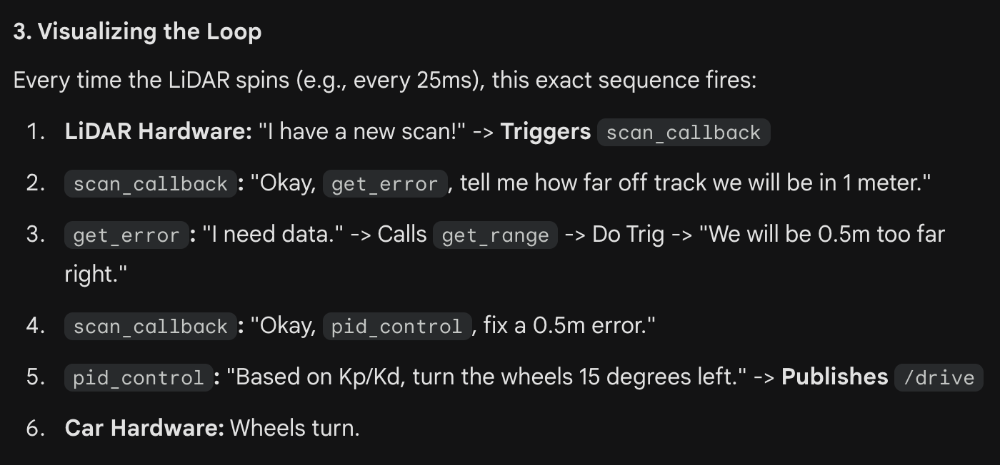

# Lab 3: Wall Following

**Assignment link:** https://github.com/f1tenth/f1tenth_lab3_template

**Deliverable":** Implementation of PID control through a node and a video submission of the simulation proving it works

Intuitive process map of the wall follow node:  

**Blockers:**  
Before running simulation:
- Node file was initially under `scripts` folder, so the command to run it didn't work (ROS couldn't find it)
- There were errors in the code but they weren't printing out the script was directly run in terminal

Tuning simulation:
- Car slowed down too much before turns, when turning it was too sharp -> lower kp, increase kd and update velocity logic to be more smooth
- Car was "double pumping" before turning -> lower kd 
- Car was falling for the divot (false turning) -> updated the get_range() function to use "cone of vision" logic instead
- Car kept turning into the wall -> set desired distance (from left wall) to 1.0

**Submission video:** https://youtu.be/78lcVt-F52M
